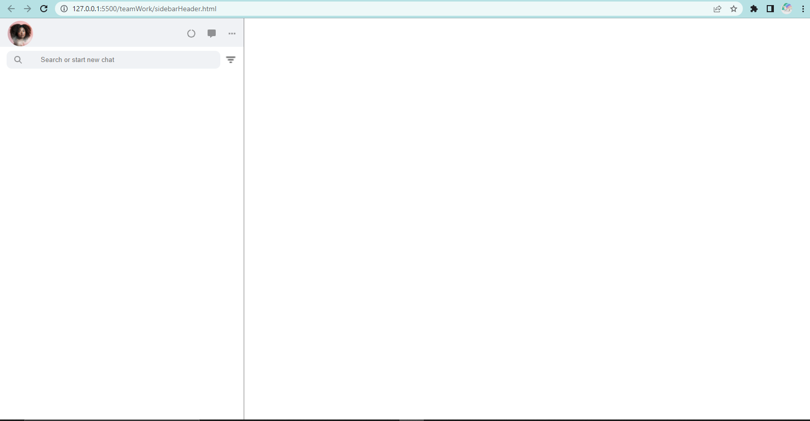
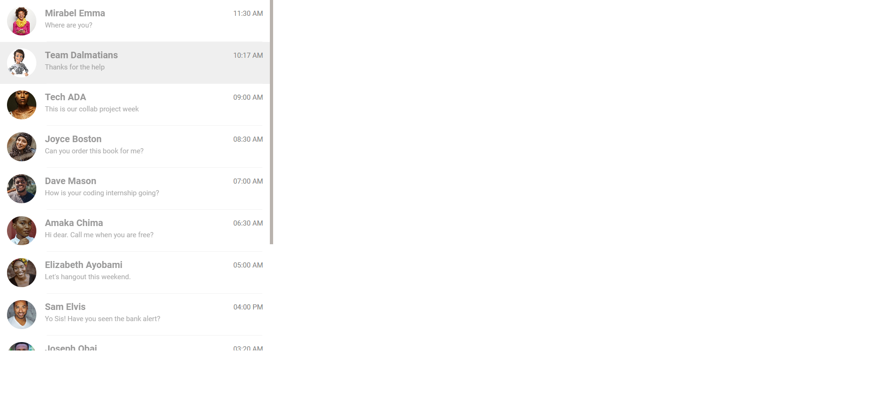
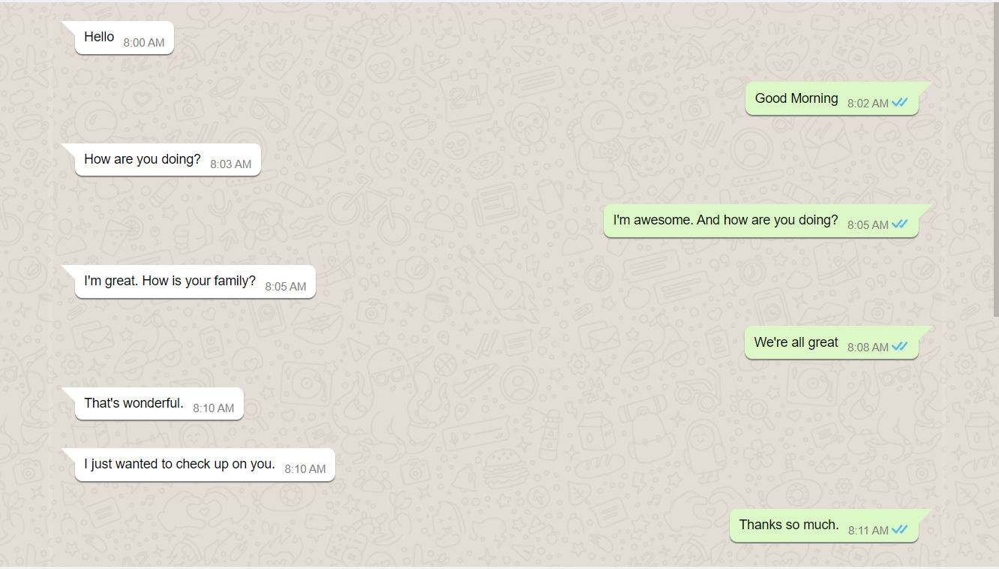
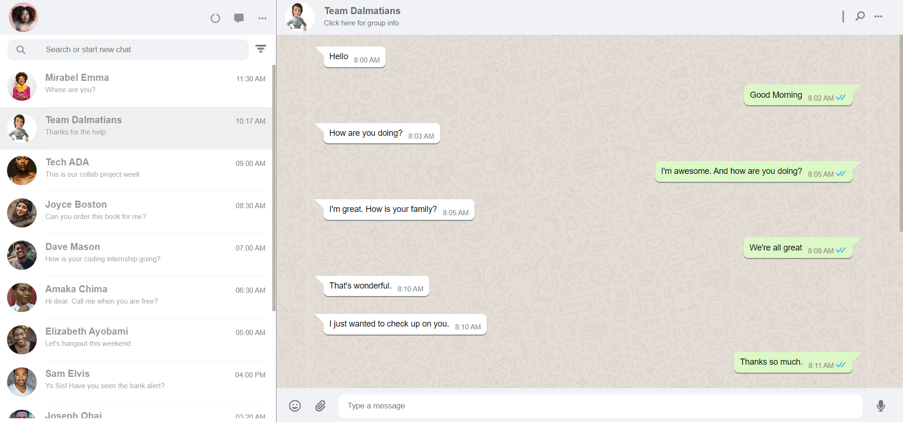

# WHATSAPP_CLONE
This is a collaborative project for the ADA Software Engineering Internship.

This is a WhatsApp clone project by "Team Dalmatians" of the Web-Frontend track.

## Overview
The project took us approximately six (6) days to complete, including daily Google Meet meetings for us to achieve and meet the deadline. During this time, we also worked on our tasks individually on our local machines to see how each task looked before joining the codes on Codesandbox to get the uniform UI.

### The challenge
Create a WhatsApp clone using only HTML and CSS

### Screenshots
[Screenshot URL](https://drive.google.com/drive/folders/1sX6X0AwaGlgvYqefgs-26VQAntxXbe-3?usp=share_link)







### Links
- [Google Drive](https://drive.google.com/drive/folders/1GhEPYS11C016KoFciW1tFsgyz4PmMcQK?usp=sharing)
- [Icons and Images](https://drive.google.com/drive/folders/1A489zyP1Gny4QIXtn1efd1vKxWaVrkJ5?usp=share_link)
- [Wireframe](https://bit.ly/3DVrtvN)
- [ClickUp](https://app.clickup.com/42086220/v/s/66175518)
- [GitHub](https://github.com/ZainabRaheem/WHATSAPP_CLONE)
- [Codesandbox](https://codesandbox.io/s/team-dalmatians-whatsapp-clone-j7hjg2?file=/index.html)

## The process
- Installed Visual Studio Code on Computer.
- The team created a ClickUp account, a Google Drive Folder, and a GitHub account, and invited all team members to collaborate on each platform.
- Each and every team member were assigned roles and responsibilities.
- The team drew the wireframe of the WhatsApp clone UI using Invision Freehand.
- Zainab was assigned the task to code the sidebar header and search section of the WhatsApp clone project.
- Adetutu was assigned the task to code the sidebar contacts and chats section of the WhatsApp clone project.
- Kasie was assigned the task to code the message content section of the WhatsApp clone project.
- Ugochukwu was assigned the task to code the message header section and the message footer section of the WhatsApp clone project.
- The team merged the codes on Codesandbox to view the UI and corrected errors in code.
- The team pushed their individual codes on GitHub and merged commits to the main branch.


### Built with

-  HTML Tags/Elements

```html
<section class="search-area">
        <div class="search">
          
          <input class="search-input"  type="text" placeholder="Search or start new chat" />
        </div>
        <div class="filter">
          
        </div>
      </section>
```

```html
<div class="chat">
          <div class="chat-avatar">
            
          </div>
          <div class="chat-info">
            <h1>Team Dalmatians</h1>
            <p>Thanks for the help</p>
          </div>
          <div class="chat-time">
            <p>10:17 AM</p>
          </div>
        </div>
```
```html
<div class="smiley right">
          <div class="chat-message triangle left-top flex">
            <p>Hello</p>
            <span class="flex time-icon">
              <span class="chat-time-mc">8:00 AM</span>
            </span>
          </div>
        </div>
```
```html
<div class="profileSection">
          <div class="right-avatar">
            
          </div>
          <div class="contactInfo">
            <h4>Team Dalmatians</h4>
            <p>Click here for group info</p>
          </div>
        </div>
```


- CSS Properties
```css
* {
  font-family: "Roboto", sans-serif;
  margin: 0;
  padding: 0;
  box-sizing: border-box;
}

body {
  display: flex;
}
```
```css
.header {
  display: flex;
  justify-content: space-between;
  align-items: center;
  padding: 5px 15px 1px;
  background-color: #f0f2f5;
}
```
```css
.right-avatar {
  height: 50px;
  width: 50px;
  border: none;
  border-radius: 50%;
  overflow: hidden;
}

.profileSection {
  display: flex;
  align-items: center;
  justify-content: center;
}
```

### Tools used

- Visual Studio Code
- Codesandbox
- InVision
- ClickUp
- Git/GitHub

## Contributors

- Adetutu Deborah Oluwasanmi - Team Lead/Frontend Developer
- Ogochukwu Ugorji - Planner/Frontend Developer
- Raheem Zainab Oluwafunke - Builder/Frontend Developer
- Kasie Ugwu - Reporter/Frontend Developer


